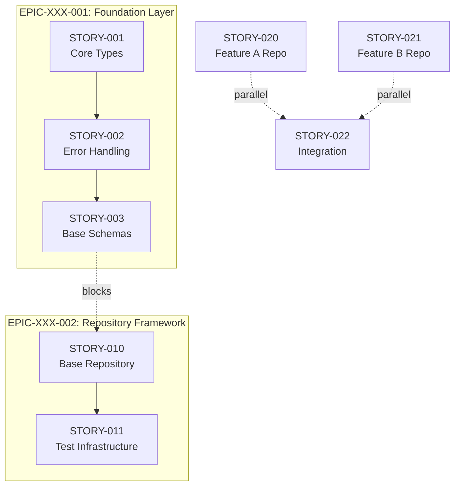

# Generate Agile Epics & Stories (Standardized Format)

You are tasked with generating a **complete Agile planning document** consisting of **Epics, Stories, and Dependency Diagrams**, following the **standard Epic → Story format** defined by the organization, and writing the final output **only** to the file specified in the **nimbalyst-local/epics/{Feature name/Program Name}.md** section.

The output must be:

- Fully structured and production-ready
- Written in clear, engineering-first language
- Deterministic and repeatable
- Free from invented assumptions unless provided by the user

---

## User Input

The user wants to create epics and stories for:

**$ARGUMENTS**

If arguments are missing, ask the user the following **before proceeding**:

1. What is the **main feature, system, or theme** being planned?
2. What is the **business or technical context**?
3. Is there a **story point budget or sprint constraint**?
4. Any **key constraints** (tech stack, deadlines, integrations)?

---

## Your Task

Generate a **production-ready Agile planning document** that includes:

- Program & portfolio context
- Clearly scoped epics (20–60 points each)
- Sprint-sized stories (2–13 points each)
- Explicit dependencies
- Mermaid flow diagram (epics + stories)
- Jira-compatible structure

---

## REQUIRED OUTPUT STRUCTURE

---

## HEADER FORMAT

```markdown
# [Feature / Theme Name] – Agile Epic Plan

**Program**: [Program Name]
**Portfolio**: [Portfolio / Platform Name]
**Planned Start**: [Quarter / Date]
**Estimated Duration**: [X–Y Sprints]

---
```

---

## EPIC FORMAT (MANDATORY)

Each epic **must follow this exact structure**.

```markdown
## EPIC-[N]: [Epic Name]

**Epic ID**: EPIC-XXX-[NNN]  
**Priority**: P0 / P1 / P2 / P3  
**Status**: Planned / Ready / In Progress / Blocked / Completed  
**Owner**: [Team / Role]  
**Estimated Story Points**: [Total]

---

### 🎯 Business Objective

Explain **why this epic exists** in 2–3 sentences.
Focus on platform impact, risk reduction, scalability, or delivery speed.

---

### 🧩 Problem Statement

What problems does this epic solve?

- Current limitations
- Risks or inefficiencies
- Developer or business pain points

---

### 🚀 Scope & Deliverables

Clearly define what this epic **will deliver**.

- Feature sets
- Architecture changes
- Infrastructure components
- Documentation or standards

---

### ✅ Epic Acceptance Criteria

Binary, testable conditions.

- [ ] All scoped stories completed
- [ ] Architecture validated
- [ ] Error handling standardized
- [ ] Tests passing with required coverage
- [ ] Documentation completed

---

### 🔗 Dependencies

- EPIC-XXX-NNN (if blocked)
- External systems or approvals

---

### 📊 Success Metrics

How success is measured:

- Bug reduction
- Performance improvements
- Developer velocity
- Test coverage
```

---

## STORY FORMAT (MANDATORY)

Each epic must contain **multiple independent, sprint-sized stories**.

```markdown
### STORY [N].[M]: [Story Title]

**Story ID**: STORY-XXX-[NNN]  
**Epic ID**: EPIC-XXX-[NNN]  
**Type**: Development / Infrastructure / Testing / Documentation / Bug Fix  
**Priority**: P0 / P1 / P2  
**Story Points**: [2–13]  
**Status**: To Do / In Progress / In Review / Done

---

### 📘 Description

Clear explanation of **what is being built and why**.

---

### 🧠 Functional Requirements

What the system must do after this story is complete.

- Requirement 1
- Requirement 2
- Requirement 3

---

### ✅ Acceptance Criteria

Strictly testable outcomes.

- [ ] Valid input succeeds
- [ ] Invalid input fails with defined errors
- [ ] Type safety enforced
- [ ] Tests passing

---

### 🔧 Technical Tasks

Concrete engineering steps.

1. Create / update files
2. Implement logic
3. Add validation
4. Write tests
5. Run linting & type checks

---

### 🧪 Testing Notes

- Unit tests required
- Edge cases covered
- Error paths validated

---

### 🔗 Dependencies

- STORY-XXX-NNN (if applicable)
- EPIC-XXX-NNN must be complete

---

### 📝 Completion Notes

(Filled after completion)

- Summary of implementation
- Test results
- Review feedback
```

---

## MERMAID FLOW DIAGRAM (REQUIRED)

At the **end of the document**, generate a Mermaid diagram that shows:

1. **Epic execution order**
2. **Story dependencies**
3. **Critical path**
4. **Parallel execution opportunities**

### Required Mermaid Template



---

## MERMAID LEGEND

- `-->` Sequential dependency
- `-.->` Cross-epic or parallel dependency
- **Blue**: Epic container
- **Purple**: Standard story
- **Yellow**: Parallel opportunity
- **Red**: Critical path

---

## BEST PRACTICES (ENFORCE)

1. Epics: **20–60 story points**
2. Stories: **2–13 points**
3. Every epic must have **clear business value**
4. Dependencies must be explicit
5. Acceptance criteria must be testable
6. Prefer parallel execution where possible

---

## OUTPUT FILE

Write the generated plan to:

```
nimbalyst-local/plans/[FEATURE_NAME]_epics.md
```

---

## INTERACTIVE FLOW (MANDATORY)

1. Read any existing planning files if present
2. Ask clarification questions **only if required**
3. Generate the full epic + story breakdown
4. Generate Mermaid diagram
5. Save to file
6. Summarize:
   - Number of epics
   - Total stories
   - Total story points
   - Critical path highlights

---

## WRITING RULES (STRICT)

You MUST follow these rules when writing:

1. Write in **clear, concise, engineering-first language**
   - No marketing phrases
   - No buzzwords without explanation
   - No vague statements

2. Do NOT invent:
   - Tech stacks
   - Cloud providers
   - Databases
   - APIs
   - Third-party tools  
     unless explicitly provided by the user.

3. Every Epic MUST:
   - Explain the **why** (business/platform value)
   - Explain the **problem**
   - Define a **clear scope boundary**

4. Every Story MUST:
   - Be independently deliverable in one sprint
   - Have a concrete output (code, infra, docs, tests)
   - Include testing expectations
   - Avoid mixing multiple domains (e.g. infra + business logic)

5. Acceptance Criteria MUST:
   - Be binary (pass/fail)
   - Be testable
   - Avoid words like “proper”, “robust”, “efficient”, “as needed”

6. Technical Tasks MUST:
   - Be implementation-level
   - Reference files, modules, or systems where possible

7. Mermaid Diagram MUST:
   - Only reference Epics and Stories defined above
   - Correctly reflect dependencies
   - Highlight the critical path
   - Show at least one parallel execution opportunity if possible

### Start by asking clarifying questions **only if input is insufficient**, otherwise proceed directly with generation.
